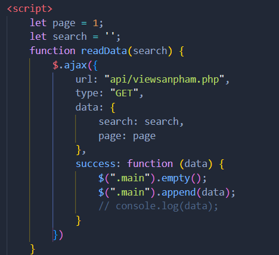
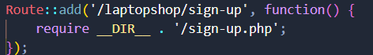
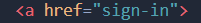
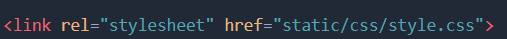

# LAPTOPSHOP
## Đọc kĩ hướng dẫn trước khi code
1) Cách tạo ajax: đưa file xử lý ajax vào laptopshop/src/api, thay đổi đường dẫn url ajax cho script là api/"tên file xử lý api", ví dụ:

2) Cách tạo đường dẫn cho trang mới: vào file main.php, thêm route vào file main.php tương tự như sau:

    sau /laptopshop/ là tên url muốn đặt

    require__DIR__ . '/ tên file cần truy cập đến

    sau khi thêm đường dẫn xong, khi nào cần dùng link thẻ a thì chỉ cần href = "tên đã đặt ở file main.php",ví dụ:

    

3) Cách sử dụng static file, link đúng đường dẫn, ví dụ:

